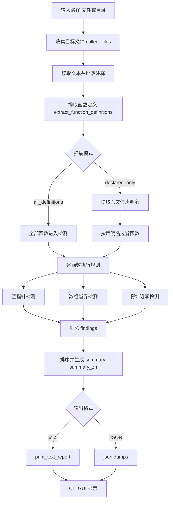
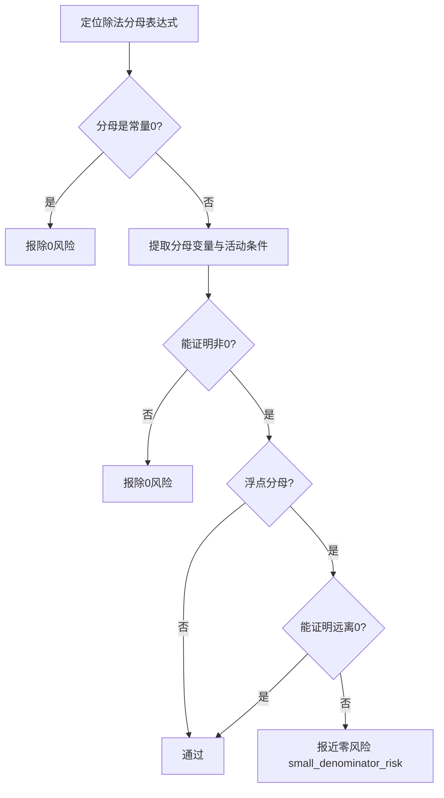

# C/C++ 风险扫描项目文档

## 1. 项目方案
### 1.1 目标
- 提供一个可落地的 C/C++ 风险扫描工具，覆盖常见代码审核场景。
- 以“函数”为最小分析单元，避免在单次扫描中强依赖跨文件声明关系。
- 输出面向研发可读的中文报告，同时提供 JSON 供二次集成。

### 1.2 技术方案
- 方案类型：启发式静态规则分析（非完整编译器语义分析）。
- 扫描输入：递归收集 `.h/.hpp/.hh/.hxx/.cpp/.cc/.cxx`。
- 扫描模式：
- `all_definitions`（默认）：扫描全部函数定义。
- `declared_only`：先提取头文件声明名，再过滤函数定义。
- 执行方式：按函数独立执行三类规则。
- 结果输出：
- 文本：三段式中文输出（空指针、越界、除0）。
- JSON：包含 `summary`、`summary_zh`、`findings` 等结构化字段。

### 1.3 实现结构
- 入口与编排：
- `scan()`：组织文件收集、函数提取、规则执行、结果汇总。
- `print_text_report()`：按统一中文模板渲染结果。
- 规则引擎：
- `detect_null_pointer_risks()`
- `detect_out_of_bounds_risks()`
- `detect_divide_by_zero_risks()`
- GUI：
- `cpp_risk_scanner_gui.py` 直接复用 `scan()` + `print_text_report()`，保证 GUI/CLI 一致。

## 2. 检测流程图
### 2.1 总体流程


### 2.2 除0/近零核心判定流程


## 3. 规则说明与已达成能力
### 3.1 空指针访问风险
- 识别解引用：`*p`、`p->x`、`p[i]`。
- 识别保护：
- `if (p)`、`if (p != nullptr/NULL/0)`
- `if (!p) return/throw/...`、`if (p == nullptr) return/...`
- `assert(p)`、`CHECK(p)`、`CHECK_NOTNULL(p)`
- 作用域与重赋值：
- 仅在有效分支作用域内继承保护。
- 指针重赋值后触发“epoch”失效，旧保护不再沿用。

### 3.2 数组越界访问风险
- 识别访问：`container[index]`。
- 索引合法性：
- 检查索引表达式是否为整型可接受表达式。
- 对非整型可疑表达式直接报风险。
- 边界保护识别：
- 上界：`i < size` / `size() > i` 等。
- 下界：`i >= 0` / `0 <= i` / `for(i=0;...)` / 无符号索引线索。
- 识别拒绝式保护：`if (i<0 || i>=size) return/throw/...`。
- 容量推断增强：
- 支持 `vector<T> v(n)`、`v.resize(n)`、`v.clear()`、C 数组声明容量。
- 对字面量索引执行容量比对：`0 <= idx < size`。
- 修复数组声明误判：`Type arr[6] = {...};` 不再当作访问点。

### 3.3 除0风险（含近零）
- 分母提取：定位 `/` 与 `%` 的分母表达式。
- 非零保护识别：
- `b != 0`、`if (b==0) return/...`、`assert(b!=0)`、`if (b)`。
- 条件推导：
- 支持 `&&`、`||`、`!` 的布尔组合推导。
- 支持条件作用域，不把不相关分支保护误迁移。
- 近零保护：
- 阈值：`SMALL_DENOMINATOR_EPS = 1e-20`。
- 支持 `abs/fabs` 风格保护表达式。
- `ZwMath::isEqual` 适配：
- `ZwMath::isEqual(x,0)` 视作 `x` 近0。
- `!ZwMath::isEqual(x,0)` 视作 `x` 非近0。
- `!ZwMath::isEqual(A,B)` 可用于保护分母 `A-B`（或 `B-A`）。
- 输出归并：
- 近零风险内部类型为 `small_denominator_risk`，对外中文统一归入“除0风险”统计与展示。

## 4. 当前可覆盖场景（细化清单）
### 4.1 可以较稳定识别的场景
- 传入指针后未判空直接解引用。
- 判空仅在某分支成立，分支外继续使用指针。
- 指针中途赋值为 `NULL/nullptr/0` 后继续使用。
- 索引变量只做上界判断未做下界判断。
- 索引未做明确边界检查直接访问容器。
- `vector` 调用 `resize()` 后容量变小，旧索引失效。
- 浮点分母只做 `!=0`，缺少远离0保护。
- 使用 `ZwMath::isEqual` 的近零/非近零判断与分母表达式关联。

### 4.2 已处理的典型误报场景
- C 数组声明 `arr[6]` 被误识别为访问点。
- 字面量安全索引（如容量10访问下标9）被误报。
- `!ZwMath::isEqual(a,b)` 分支内 `1/(a-b)` 被误报为除0。

### 4.3 仍属于边界的场景
- 深度宏展开后语义、模板复杂实例化语义。
- 跨函数数据流、跨文件别名传播、复杂对象生命周期。
- 需要完整类型系统/符号表才能证明安全的场景。

## 5. 交付与使用方式
### 5.1 CLI
```bash
python cpp_risk_scanner.py ./sample
python cpp_risk_scanner.py ./sample --json
python cpp_risk_scanner.py ./sample --declared-only
```

### 5.2 GUI
```bash
python cpp_risk_scanner_gui.py
```

- 上区显示结果，下区操作按钮（选择目录、开始扫描）。
- GUI 与 CLI 复用同一检测逻辑，输出一致。

## 6. 已达成目标总结
- 达成“函数级独立审核”目标，不强依赖跨文件声明关系。
- 达成三类核心风险的统一检测与中文输出。
- 达成近零分母风险纳入除0统计的统一呈现。
- 达成 GUI/CLI 规则一致，便于研发自测与日常审查接入。
